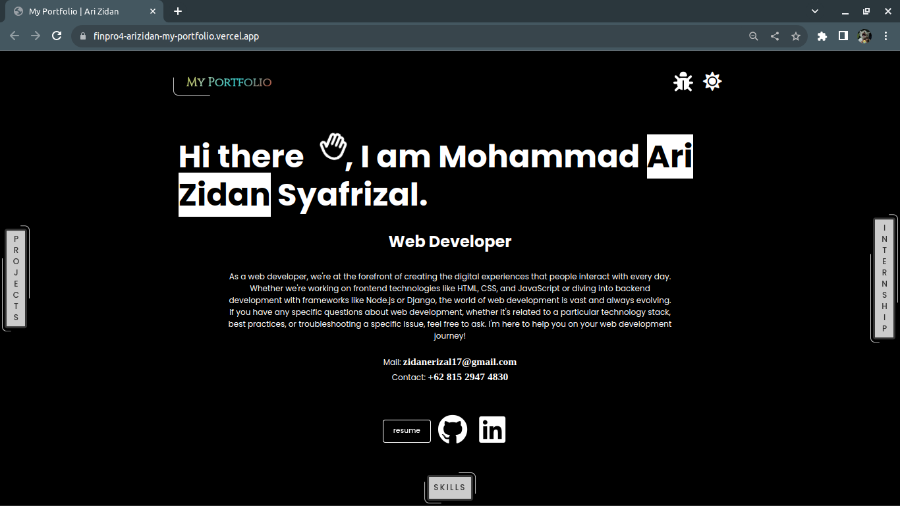

# My Portfolio

 
> For the **Demo** checkout this link👇:  
<a href="https://finpro4-arizidan-my-portfolio.vercel.app/" target="_blank">My Portfolio | Ari Zidane</a>  

## Introduction

Hi there! 👋 I'm Mohammad Ari Zidan Syafrizal, a passionate web developer with expertise in HTML, CSS, and JavaScript. This is my portfolio website where you can learn more about me, check out my projects, and even change the theme!

## Table of Contents

- [Introduction](#introduction)
- [Projects](#projects)
- [Internships & Certifications](#internships--certifications)
- [Skills](#skills)
- [Features](#features)
- [Contact](#contact)

## Features

My Portfolio contains

- **Preloader Animation:** Animated preloader for a visually appealing loading experience.
- **Dark and Light Themes:** Toggle between dark and light themes for personalized viewing.
- **Parallax Mode:** Engage parallax mode for a dynamic scrolling experience.
- **Scroll-Lock Mode:** Disable scrolling in desktop view for a cleaner interface.
- **Element Transitions:** Smooth transitions between sections for seamless navigation.
- **Component Animations:** Animated components for a lively and engaging interface.
- **Hover Effects:** Dynamic hover effects on elements and text for enhanced interactivity.
- **Solid and Animated Backgrounds:** Choose between solid and animated backgrounds for visual variety.
- **Local Storage Integration:** Save theme and mode preferences in local storage for a personalized experience.

## Contact

- Email: zidanerizal17@gmail.com
- Contact: +62 815 2947 4830

## Created By

M Ari Zidan S
